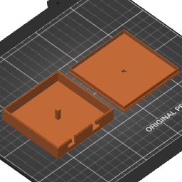

# Cable Case

A box to wind cables in and have just the connectors sticking out for organizing
and quickly recognizing cables.

Written in OpenSCAD, STL generated by OpenSCAD.

Sliced to GCode for Prusa MK3S by PrusaSlicer.

3MF OPC ZIP PrusaSlicer project file converted to directory using
`curl hubelbauer.art/3mf -L | sh`.
